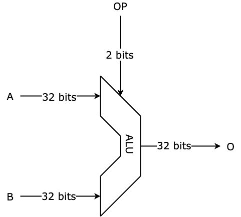
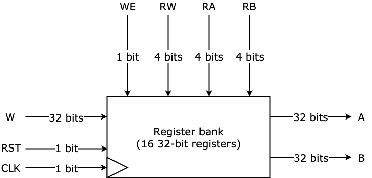
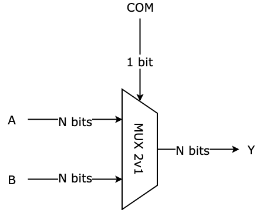
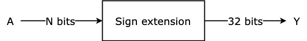
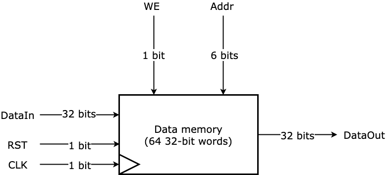

# Monocycle MIPS Processor

This is based on a university project of the EISE specialty at Polytech Sorbonne (2018-2019). The goal is to build a processor in VHDL capable of executing a subset of the MIPS instruction set. I tried to re-implement it using only [ghdl](http://ghdl.free.fr/) and [gtkwave](http://gtkwave.sourceforge.net/) for testing (and possibly expand it into a multicycle processor). It also serves as a basic demonstration of how to integrate ghdl & gtkwave into a smooth VHDL workflow without using any other IDEs or simulators; I'm programming this processor using only a text editor and a terminal.

---

## Getting started

If you're looking to work/expand on this project or just run it on your machine, here's how you can get started.

### Installing ghdl
According to their [site](http://ghdl.free.fr/site/pmwiki.php?n=Main.Download) this was supposed to be easy, but the package doesn't exist in the `apt` database (or at least I couldn't find it), so the next easiest/most reliable thing is to build it from source. You have to install [GNAT](http://libre2.adacore.com/) if you don't have it, and then you can just clone their [github repo](https://github.com/ghdl/ghdl) and build normally:

```
$ ./configure
$ make
$ make install
```

**Note**: (In Ubuntu,) I needed to use `sudo` in order to install it, but it somehow couldn't find `gnatmake` when I did that. My solution was to edit both the `configure` file and the `Makefile` of the ghdl repo clone and give them the absolute path for `gnatmake` (in my case it was `/opt/GNAT/2019/bin/gnatmake`). I also have this whole setup on my Mac and I could just build from source without any problems.

### Installing gtkwave
This is pretty easy. You can just fetch it via `apt`:

```
$ sudo apt-get install gtkwave
```

And on Mac you can fetch it through [Homebrew](https://brew.sh/):

```
$ brew install gtkwave
```

---

## Processor architecture

Table of contents

- [ALU](#alu)
- [Register bank](#register-bank)
- [MUX 2v1](#mux-2v1)
- [Sign extension](#sign-extension)
- [Data memory](#data-memory)


### ALU

The ALU (Arithmetic and Logic Unit) takes care of performing basic mathematical operations:



Based on the value of `OP`, the operations it performs have as follows:

| OP  | O     |
| :-: | :---: |
| 00  | A + B |
| 01  | B     |
| 10  | A - B |
| 11  | A     |


### Register bank

The register bank contains the CPU's 16 32-bit registers.



#### Read
The read operations are asynchronous; outputs `A` and `B` contain the values found at the addresses `RA` and `RB` respectively. When `RA` and/or `RB` are undefined, `A` and/or `B` output the value of the register at address `0`.

#### Write
The write operations are synchronous, and are performed on the clock's rising edge. On rising edge, if `WE = 1` and `RW` is not undefined, the value of the `W` bus is written onto the register at address `RW`.

The `RST` is asynchronous.


### MUX 2v1

This is a simple 2v1 multiplexer.



Here are the outputs based on `COM`'s value:

| COM  | Y   |
| :--: | :-: |
| 0    | A   |
| 1    | B   |


### Sign extension

This is a simple one input, one output block that converts an N-bit input into a 32-bit output, while keeping the same sign (+/-).



Of course, here `N <= 32`.


### Data memory

This is a data memory containing a storage space of 64 32-bit words. Its architecture is not that different from that of the [register bank](#register-bank):



#### Read
The read operation is asynchronous; `DataOut` contains the value of the word at address `Addr`, or the word at address `0` if `Addr` is undefined.

#### Write
The write operation is synchronous, and is performed on the clock's rising edge. On rising edge, if `WE = 1` and `Addr` is defined, then the 32-bit word in `DataIn` is stored at address `Addr` in the memory.
